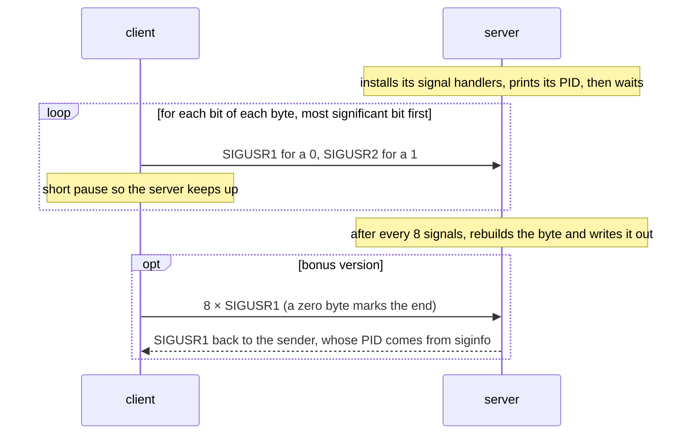

# minitalk

[](https://github.com/fasharif/MiniTalk-42/actions/workflows/ci.yml)

A client and a server that talk using nothing but two Unix signals, `SIGUSR1` and
`SIGUSR2`. The client sends a text message one bit at a time; the server rebuilds each
byte and prints it. Written in C for the 42 Abu Dhabi curriculum.

```
$ ./server
4821
Hello, 42! مرحبا 👋
```

```
$ ./client 4821 "Hello, 42! مرحبا 👋"    # in a second terminal
```

## How it works



- Bytes are sent exactly as they are, so any UTF-8 text works, including Arabic and emoji.
- The server keeps the bits received so far in static variables inside its signal handler,
  and the handler only calls functions that are safe there (`write` and `kill`).
- The client checks the PID before sending anything: it must be a positive number and a
  process the client is allowed to signal. `kill()` treats `0` as "my whole process group"
  and `-1` as "every process I may signal", so an unchecked PID could terminate them all.

## Build and run

```bash
make          # server and client
make bonus    # server_bonus and client_bonus: end marker and acknowledgement
./server                          # prints its PID
./client <PID> "your message"     # in another terminal
```

## Testing

[`tests/run_e2e.sh`](tests/run_e2e.sh) starts each server, sends a message mixing ASCII,
Arabic and emoji, and checks that the server printed it exactly. It also checks that invalid
PIDs (`0`, `-1`, `/`, text, numbers too large to be a PID) and PIDs with no running process
are rejected. GitHub Actions builds with GCC and Clang, with warnings treated as errors, and
runs the tests on every push and pull request.

## Limitations

- Bits are not acknowledged one by one, so the client pauses between signals. On a very busy
  machine two identical signals can merge into one and corrupt a message.
- One client at a time: two clients sending together would interleave their bits.
- `client_bonus` exits straight after sending, so it can finish before the server's
  acknowledgement arrives and miss printing `SIGNAL RECEIVED`.
